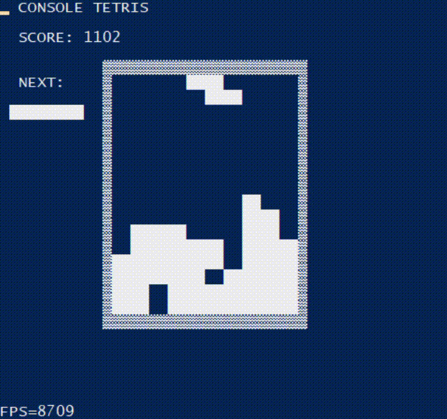

# Console Tetris
Tetris game in Windows console.

Compilation example (using LLVM clang++ compiler): `clang++ -O3 -DUNICODE -D_UNICODE -luser32 -Iinclude *.cpp source/*.cpp -o tetris.exe`

## Gameplay
Controls:
- `a` - move left
- `d` - move right
- `s` - drop
- `space` - rotate

